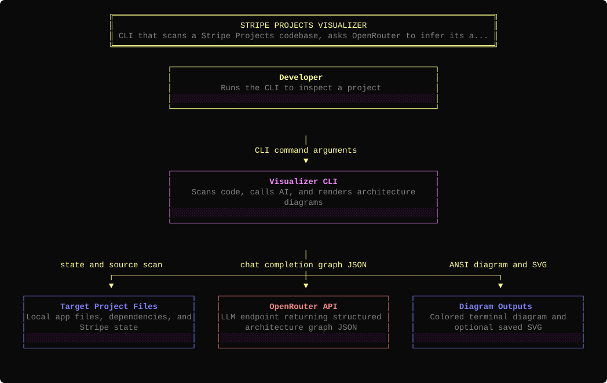
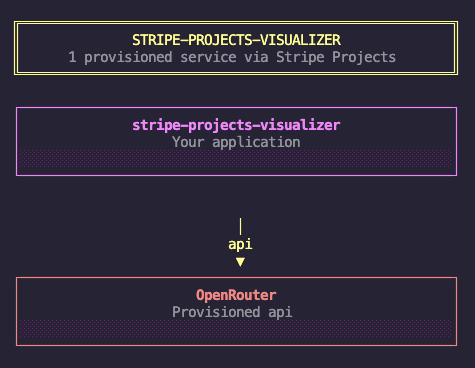

# stripe-projects-visualizer

Visualize the architecture and data flow of a [Stripe Projects](https://projects.dev) app. Reads `state.json`, scans your codebase, and uses an AI model to generate an architecture diagram showing how your provisioned services connect and how data flows between them.



## Install

```bash
npm install -g stripe-projects-visualizer
```

Or run directly with npx:

```bash
npx stripe-projects-visualizer visualize
```

## Prerequisites

- **Node.js 24+**
- A Stripe Projects-initialized directory (must contain `.projects/state.json`)
- `OPENROUTER_API_KEY` environment variable (optional — enables AI-powered diagrams)

Without an API key the tool runs in **basic mode**, producing a simple diagram of your provisioned services from `state.json`. For richer AI-powered diagrams that show data flow, architecture layers, and how your code connects to each service, provision an OpenRouter key:

```bash
stripe projects add openrouter/api
stripe projects env --pull
source .env
```

## Usage

```bash
# Visualize the current directory
stripe-projects-viz visualize

# Visualize a specific project
stripe-projects-viz visualize --dir /path/to/project

# Choose a specific model (default: openrouter/auto)
stripe-projects-viz visualize --model anthropic/claude-sonnet-4
stripe-projects-viz visualize -m google/gemini-2.5-flash

# Skip AI and show a simple diagram from state.json
stripe-projects-viz visualize --basic

# Auto-save SVG without prompting
stripe-projects-viz visualize --save-svg
```

### AI mode (default)

When `OPENROUTER_API_KEY` is set, the tool will:

1. Read `.projects/state.json` to discover provisioned services
2. Scan the codebase (file tree, dependencies, README, key source files)
3. Send the context to an AI model to analyze the architecture
4. Render a colorful data-flow diagram in the terminal
5. Optionally save the diagram as `.projects/architecture.svg`

### Basic mode (`--basic`)

Shows a simple diagram of your provisioned services directly from `state.json`, no API key required. Useful for a quick overview or offline use.



## Development

```bash
npm install
npm run build
npm test
```
